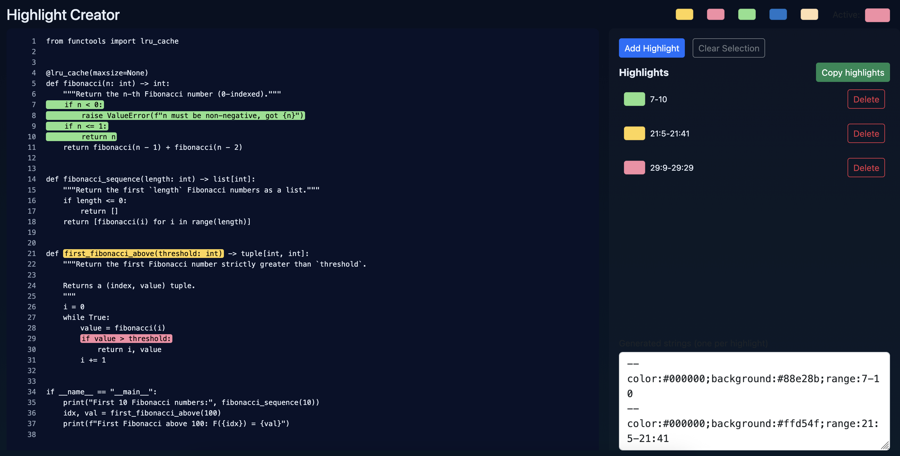
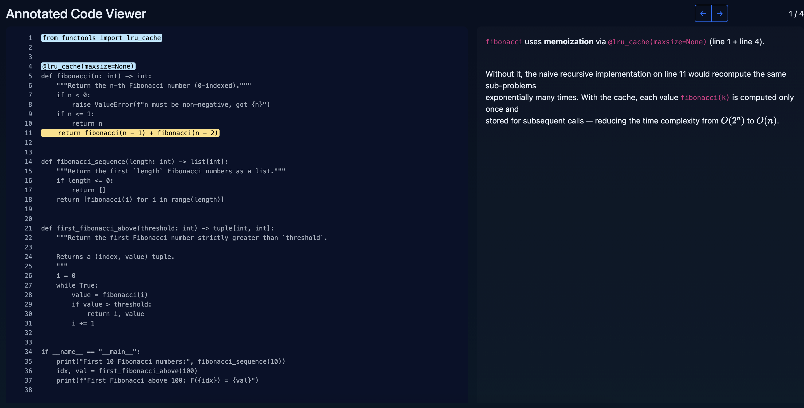

# annotated-code

A tool to create interactive, browser-based visualizations that explain source code through highlighted annotations.

Two complementary workflows are supported:

| Workflow | Script | What it produces |
|---|---|---|
| **Highlight viewer** | `generate_highlight.py` | An interactive page where you can select and highlight arbitrary line/column ranges in a file manually in the browser |
| **Annotation viewer** | `generate_viz.py` | A static page pre-loaded with a set of written annotations, each of which highlights one or more ranges in the code |

---

## Requirements

- Python ≥ 3.13
- [uv](https://github.com/astral-sh/uv) (recommended) **or** pip

---

## Installation

### With uv (recommended)

```bash
git clone https://github.com/tbluche/annotated-code.git
cd annotated-code
uv sync
```

All scripts must then be run with `uv run` so that the package is on the path (see examples below).

### With pip

```bash
git clone https://github.com/tbluche/annotated-code.git
cd annotated-code
pip install -e .
```

---

## Project structure

```
annotated-code/
├── src/annotated_code/   # Core Python package
│   └── model.py          # Pydantic models + annotation file parser
├── scripts/
│   ├── generate_highlight.py   # Script 1 – highlight viewer
│   └── generate_viz.py         # Script 2 – annotation viewer
├── templates/
│   ├── template_highlight/     # HTML/JS/CSS template for the highlight viewer
│   └── template_viz/           # HTML/JS/CSS template for the annotation viewer
├── examples/
│   └── fibonacci/              # Minimal worked example (see Quickstart below)
│       ├── code.py
│       └── annotations.md
└── pyproject.toml
```

---

## Script 1 – Highlight viewer (`generate_highlight.py`)



Embeds a source file into a ready-to-open HTML page. No annotations are required; the highlighting is done interactively in the browser.

### Usage

```
python scripts/generate_highlight.py <code_file> [--out <name>] [--dst <dir>]
```

| Argument | Required | Description |
|---|---|---|
| `code_file` | yes | Path to the source file to embed |
| `--out` | no | Name of the output folder (defaults to the filename without extension) |
| `--dst` | no | Parent directory for the output (defaults to `out_viz_highlight/` in the project root) |

### Example

```bash
uv run python scripts/generate_highlight.py \
    examples/fibonacci/code.py \
    --dst=examples/fibonacci_highlight
# With pip install -e .:  python scripts/generate_highlight.py examples/fibonacci/code.py --dst=examples/fibonacci_highlight
```

This creates `out_viz_highlight/code/index.html`. Open that file in any browser to use the viewer.

---

## Script 2 – Annotation viewer (`generate_viz.py`)



Combines a source file with a pre-written annotation file and generates a self-contained HTML page that displays each annotation alongside highlighted code ranges.

### Usage

```
python scripts/generate_viz.py <code_file> <annotations_file> [--out <name>] [--dst <dir>]
```

| Argument | Required | Description |
|---|---|---|
| `code_file` | yes | Path to the source file to embed |
| `annotations_file` | yes | Path to the `.md` annotations file (see format below) |
| `--out` | no | Name of the output folder (defaults to the filename without extension) |
| `--dst` | no | Parent directory for the output (defaults to `out_viz/` in the project root) |

### Example

```bash
uv run python scripts/generate_viz.py \
    examples/fibonacci/code.py \
    examples/fibonacci/annotations.md \
    --dst=examples/fibonacci_viz
```

This creates `out_viz/code/index.html`. Open that file in any browser to read the annotated explanation.

The `examples/fibonacci/` folder contains a self-contained example: a short Python module with four
functions and a matching `annotations.md` that describes memoization, base cases, a list
comprehension, and an unbounded loop — each annotation highlights the exact lines it refers to.

---

## Annotation file format

Annotation files are plain Markdown-like text files. Each annotation block is separated by a line of five or more dashes (`-----`).

Inside a block, highlight specifications come first (lines starting with `--`), followed by the explanatory text.

### Highlight specification syntax

```
-- color:<hex>;background:<hex>;range:<range>[,<range>...]
```

- **`color`** – foreground (text) colour as a 6-digit hex value, e.g. `#000000`
- **`background`** – background highlight colour, e.g. `#ffd54f`
- **`range`** – one or more comma-separated range descriptors:

| Range syntax | Meaning |
|---|---|
| `N` | Line N only |
| `N-M` | Lines N through M |
| `L:C` | Line L, column C |
| `L1:C1-L2:C2` | From line L1 col C1 to line L2 col C2 |

### Example annotation file

```
-----

-- color:#000000;background:#ffd54f;range:1-5
-- color:#000000;background:#a5d6a7;range:10-12

This section sets up the model and loads the weights.
Lines 1-5 define the architecture; lines 10-12 restore the checkpoint.

-----

-- color:#ffffff;background:#ef9a9a;range:20:1-20:40

This single expression computes the loss.

-----
```

---

## Core data model (`src/annotated_code/model.py`)

You can also build and manipulate annotated-code objects directly in Python:

```python
from annotated_code.model import AnnotatedCode, Annotation, Highlight, Range

annotation = Annotation(
    text="This function calculates the factorial of a number.",
    highlights=[
        Highlight(
            color="#000000",
            background="#ffd54f",
            ranges=[
                Range(start_line=1, end_line=3),
                Range(start_line=5, start_column=1, end_column=10),
            ],
        )
    ],
)

annotated_code = AnnotatedCode(code="<escaped html>", annotations=[annotation])
print(annotated_code.model_dump_json(indent=2))
```

---

## Output structure

Both scripts produce a self-contained folder with three files:

```
out_viz_highlight/<name>/
├── index.html   # Open this in a browser
├── app.js
└── style.css
```

No server is required — just open `index.html` directly.
